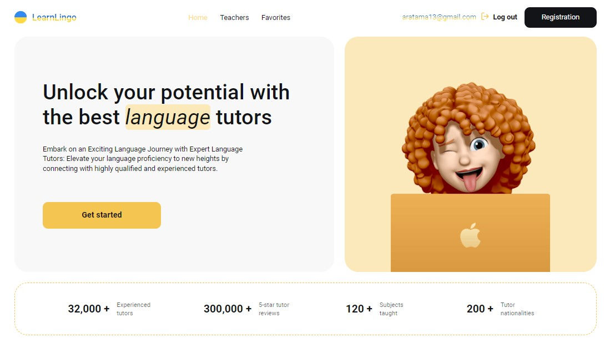

## 𝕃𝕖𝕒𝕣𝕟 𝕃𝕚𝕟𝕘𝕠

  

This project was created using [Vite](https://vitejs.dev/) + [Create React App](https://github.com/facebook/create-react-app).  
The application allows you to find a teacher for learning foreign languages. 
It is also possible to filter by different criteria and add cards of interest to favorites. 
Authorization and Firebase database are provided.

## 𝔽𝕖𝕒𝕥𝕦𝕣𝕖𝕤 ᎓   

※ Firebase authorization by email or Google account  
※ View a list of available teachers  
※ Filter teachers based on various criteria (e.g., languages, level of knowledge, price)  
※ Mark teachers as favorites  
※ Pagination for browsing through the teacher list  

## 𝕋𝕖𝕔𝕙𝕟𝕠𝕝𝕠𝕘𝕚𝕖𝕤 ᎓ 

</a>&nbsp;
  &nbsp;
  &nbsp;
  &nbsp;
  &nbsp;
  &nbsp;
  &nbsp;
  &nbsp;
  &nbsp;
  &nbsp;  
  
※ [Vite.js](https://vitejs.dev/) & [React.js](https://react.dev): for building user interfaces.   
※ [React Router DOM](https://www.npmjs.com/package/react-router-dom): Declarative routing for React web applications.  
※ [Redux Toolkit](https://redux-toolkit.js.org): State management for React applications.  
※ [Styled Components](https://styled-components.com): Styling library for React components.  
※ [Formik](https://formik.org/) and [Yup](https://formik.org/docs/tutorial#schema-validation-with-yup): for data collection and validation.  
※ [Axios](https://axios-http.com): HTTP client for database operation.  
※ [Firebase](https://firebase.google.com/): for authorization and creating database.  

## 𝕀𝕟𝕤𝕥𝕒𝕝𝕝𝕒𝕥𝕚𝕠𝕟 ᎓  

To get started with this project, follow the installation instructions below.

1. Clone the repository:
   ```bash
   git clone https://github.com/Morifer79/react-project_learn-lingo.git
   cd react-project_learn-lingo-app
   ```
2. Install the dependencies:
   ```bash
   npm install
   ```
3. Start the development server:
   ```bash
   npm start
   ```
4. Open to view it in the browser:  
<a href="https://morifer79.github.io/react-project_learn-lingo/"></a>

## 𝔼𝕞𝕒𝕚𝕝 𝕞𝕖 ᎓
Questions, suggestions, help:  
<a href="mailto:cyber-morifer@proton.me"></a>
   
